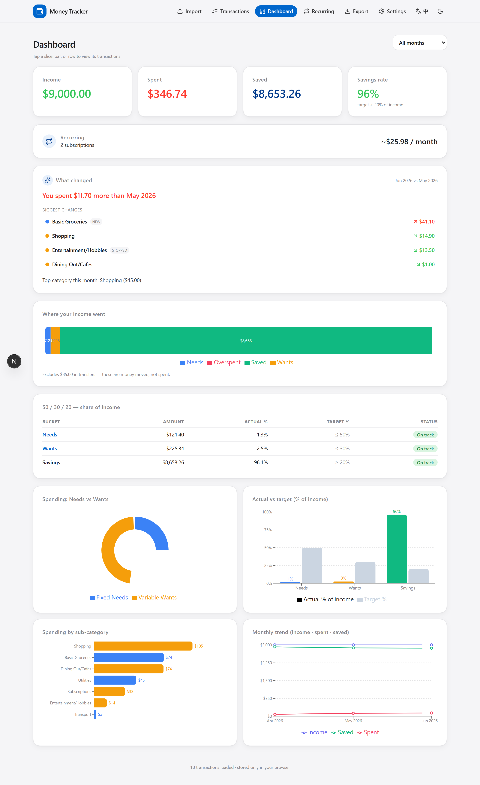
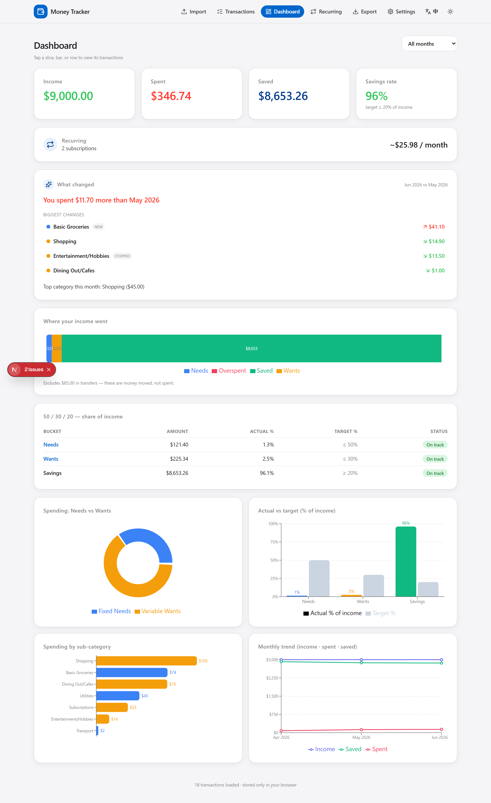

# Money Tracker — Web App

A fully client-side personal expense tracker. Import a bank CSV, categorize
spending into **Fixed Needs / Variable Wants** (savings is an outcome — Income −
Spending — not a spend bucket), and explore a clean dashboard. **Your data never
leaves your browser** — parsing, storage, and charts all run locally; nothing is
uploaded.

This is the interactive successor to the Python `build_tracker.py` + Excel
workflow in the repository root.

## Screenshots

| Light | Dark |
| --- | --- |
|  |  |

_Dashboard rendered from the built-in demo data (no real bank data)._


## Stack

- **Next.js 16** (App Router) + **TypeScript**, **Tailwind CSS v4**
- **PapaParse** (CSV), **Recharts** (charts), **SheetJS** (xlsx export),
  **html-to-image** (share cards)
- **Zustand** + **IndexedDB** (`idb-keyval`) for private, persistent local storage
- **Apple-inspired** visual theme (clean typography, rounded cards, light/dark)

## Develop

```bash
cd web
npm install
npm run dev      # http://localhost:3000
npm run build    # production build (static)
npm run lint
npx tsx scripts/smoke-parse.ts   # parser parity test vs the sample OCBC CSV
```

## Features

- **Import** — drag-drop a CSV. OCBC statements are auto-detected; any other bank
  works via the **column-mapping wizard**, which can save reusable presets.
  Includes per-bank "how to download your CSV" guidance and a **demo dataset**.
- **Transactions** — one filterable list (pillar, sub-category, month, type,
  "Needs review", search, sort; filters live in the URL). View and recategorize
  inline with dependent Pillar -> Sub-Category dropdowns, provenance badges, bulk
  apply, and **learned merchant memory**. Tapping a category on the Dashboard
  deep-links here pre-filtered.
- **Dashboard** — month / all / custom range selector; Income / Spent / Saved and
  **Savings-Rate** cards; a **"Where your income went"** flow bar; a **50/30/20
  (share-of-income)** table with status; and charts (Needs-vs-Wants pie,
  actual-vs-target bars, sub-category bars, monthly income/spent/saved trend).
  Savings is treated as an **outcome** (Income − Spending), not a spend category;
  **transfers** (savings/investment moves + P2P) are auto-detected and **excluded
  from spending**.
- **Recurring** — auto-detected subscriptions & bills (stable, ~monthly) and
  frequent merchants, with average amount, cadence, and next-expected date. A
  Dashboard card summarizes your monthly commitment; each item drills into its
  transactions.
- **Spending Insights** — a Dashboard **"What changed"** card comparing the two
  latest months: total-spend delta, the biggest category movers (↑/↓, colored by
  pillar, click to drill into those transactions), and your top category this month.
- **Settings** — edit budget targets, monthly income, remembered merchants and
  saved bank presets; one-click clear-all (privacy reset).
- **Export** — optional CSV and `.xlsx` (mirrors the original workbook), plus a
  **share-card builder** (selectable range + metrics + theme -> PNG).
- **Polish** — Apple-inspired theme, **dark mode** toggle, **English / 中文**
  language toggle, responsive layout, and an installable **PWA** (iOS "Add to
  Home Screen" with app icons).

## Architecture

```
src/
  app/                 # routes: / (import), /import/map, /review, /dashboard, /export, /settings
  components/          # UI kit (Button, Card, Badge, Select, charts, shell)
  lib/
    taxonomy.ts        # canonical pillars/sub-categories/targets (mirrors Python)
    categorize.ts      # rules + precedence + merchant-key extraction
    banks/             # adapter layer: ocbc preset, generic mapping, auto-detect, pipeline
    store.ts           # Zustand + IndexedDB persistence
    selectors.ts       # dashboard aggregations + range filtering
    exporters/         # csv + xlsx (share card lives in the export page)
```

Categorization precedence: **manual override -> learned merchant rule -> keyword
rule -> transfer detection -> default (Variable Wants -> Shopping)**.

**Spending model.** Money is split by transaction type: `spending` (Fixed Needs /
Variable Wants), `transfer` (savings/investment + P2P — excluded from spending),
and `income`. Savings is an outcome: **Savings = Income - Spending**, and the
50/30/20 rule is evaluated as a **share of income**.

## Deploy to Vercel

This is a standard Next.js app and deploys with zero config:

1. Push the repo to GitHub.
2. In Vercel, **Import Project** and set the **Root Directory** to `web/`.
3. Deploy. (Framework preset: Next.js — detected automatically.)

Or from the CLI:

```bash
cd web
npx vercel        # preview
npx vercel --prod # production
```

No environment variables or backend are required.
